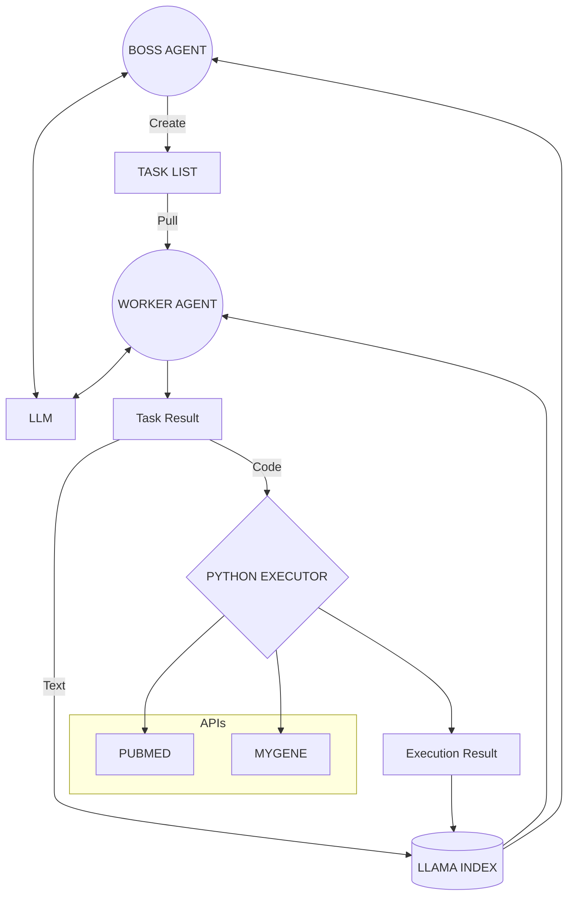

# INSIGHT

Insight is an autonomous AI that can do medical research. It has a boss agent that takes an objective and an executive summary of the tasks completed already and their results and creates a task list. A worker agent picks up a task from the list and completes it, saving the results to llama index. The boss gets informed of the results and changes/reprioritizes the task list. The workers can call into the pubmed and mygene APIs (more to come). The workers also get context from llama index to help complete their tasks.

Very much a work in progress, but it is showing some early results!

Please reach out to me or contribute if this interests you :)




## Getting Started

1. Sign up for [OpenAI](https://platform.openai.com/signup)

2. Expose the following environment vars
    - EMAIL
    - OPENAI_API_KEY
    - OPENAI_ORG

3. run `pip install -r requirements.txt`
4. run `python main.py`


BE MINDFUL OF EXPENSES!!

Currently an execution for a few minutes should cost no more than a few cents. This will go up if you use a more powerful model like GPT-4

NOTE:

At the bottom of the main.py loop there is a break statement to safeguard against the loop running forever.


```py
if task_id_counter > 15:
    break
```
 
The program will cease execution after 15 iterations and your state will be lost. This is fine while we continue developement, but once the program starts to produce useful outputs this should change.


## TODOs

**Right now it seems to get overly focused on one area. Better executive summaries might fix this.**

* Look into composable indicies with llama index


**Explicitly inform boss about worker errors. Ensure boss handles them gracefully.**

* example: code execution issue


**Expand APIs**

* more useful examples
* different APIs
* NOTE: prompt space is out most scarce commodity. Be as terse as possible and be careful not to add redundancies


**Implement token limit constraints**

* currently it's possible to pass an agent a prompt with say 4096 tokens, leaving it space for only one single token for its completion. This should be fixed, but whatever error is passed should be propagated and fixed gracefully


**Rework project structure**

* potentially abstractions as well?


**Allow way to save and reload program**


**Implement logging**

* Ideally the output of every run should be saved to its own log file