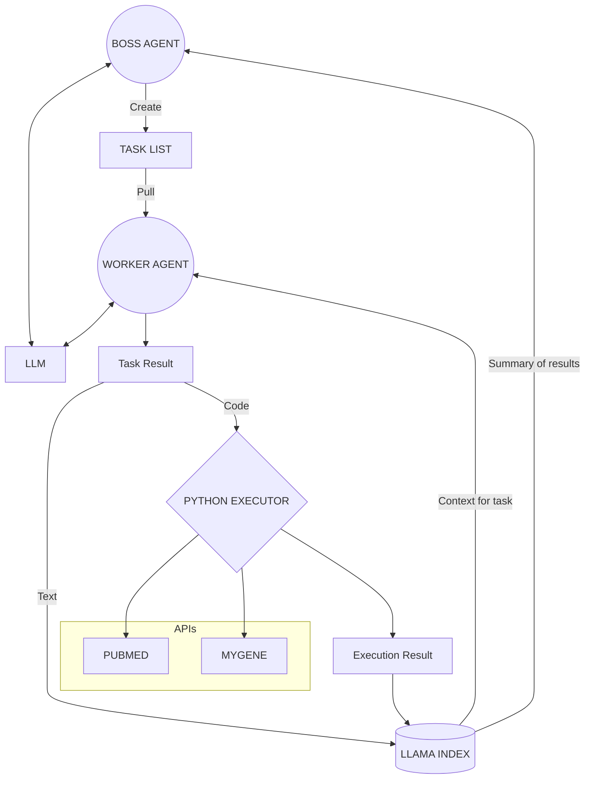

# INSIGHT

Insight is an autonomous AI that can do medical research. It has a boss agent that takes an objective and an executive summary of the tasks completed already and their results and creates a task list. A worker agent picks up a task from the list and completes it, saving the results to llama index. The boss gets informed of the results and changes/reprioritizes the task list. The workers can call into the pubmed and mygene APIs (more to come). The workers also get context from llama index to help complete their tasks.

You can reload and continue runs by following the instructions at the bottom of `main.py`

You can also load in your own data that will be used along side the data INSIGHT finds! Just pass a path to the data in `main.py`

You can also load your llama Index database and talk to it, asking arbitrary questions about your data, by running `talk_to_index.py`
You will have to specify the path to your index in the bottom of the file. See the bottom of `talk_to_index.py` for an example.

Please reach out to me or contribute if this interests you :) My email is oneil512@umn.edu




## Getting Started

1. Sign up for [OpenAI](https://platform.openai.com/signup)

2. Expose the following environment variables
    - EMAIL
    - OPENAI_API_KEY

    OR

    Add your email and api key to the config file. IF YOU DO THIS, DO NOT COMMIT THEM WITH ANY VERSION CONTROL SYSTEM!

3. run `pip install -r requirements.txt`
4. run `python main.py`

You can specify your own parameters like what tools to use, what objective to use, how many iterations to run, and load your own data in by passing a path to the file. See the bottom of `main.py`

## Output

The program saves the result from every task and adds it to the output directory `out`

It also creates a key findings markdown file over all results that distills the data via the following commands:

* Give a brief high level summary of all the data.
* Briefly list all the main points that the data covers.
* Give all of the key insights about the data.
* Generate several creative hypotheses given the data.
* What are some high level research directions to explore further given the data?
* Describe the key findings in great detail. Do not include filler words.

Arbitrary commands can be added. Open this in a markdown editor for the best experience.

Here is an example output structure

```
.
└── out  /
    ├── Objective  /
    │   ├── Task 1/
    │   │   ├── Result 1/
    │   │   │   ├── Raw Result
    │   │   │   └── Vector Embedding of Result
    │   │   ├── Result 2/
    │   │   │   ├── Raw Result
    │   │   │   └── Vector Embedding of Result
    │   │   ├── .
    │   │   ├── .
    │   │   ├── Summary of task results
    │   │   └── API Call (If task was an API call)
    │   ├── Task 2
    │   ├── .
    │   ├── .
    │   ├── .
    │   └── Task N
    └── key_findings.md
```


BE MINDFUL OF EXPENSES!!

Currently an execution for a few minutes should cost no more than a few cents. This will go up if you use a more powerful model like GPT-4